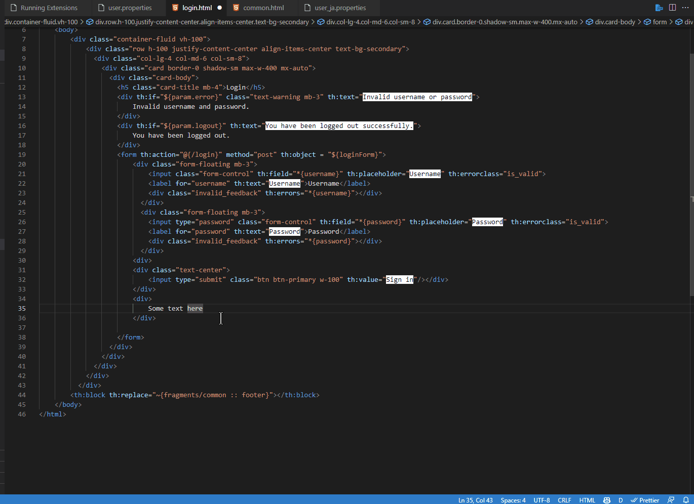

# thymeleaf-i18n-helper README

thymeleaf-i18n-helper is i18n messages helper for Spring Boot Thymeleaf message.

## Features

Can convert text on selection to #{message} and adds it to message properties file
Prompts user for variable name with default value and file
Can switch between available languages based on properties file with selection in status bar
Can detect if text already exists or if variable already exists
Can create th:text if it detects it's only text within the tag
    Otherwise it creates a span with remove tag

## Requirements

- Spring boot with thymeleaf and properties files
- Tested on boot 3

## Extension Settings

- `thymeleaf-i18n-helper.exclude`: (Optional) Exclude files.
- `thymeleaf-i18n-helper.folder`: (Optional) Specify i18n path to restrict search in those files.

## Known Issues

Still early version and experimental

## Release Notes

### 0.0.3

Fixed bugs in folder watching and exclusions

### 0.0.2

ReadMe changes

### 0.0.1

Initial pre-release
